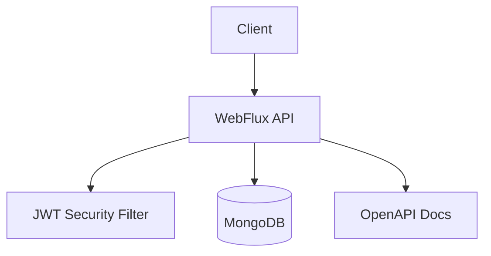

# A-AND-I Report Server
> **한 줄 소개**: 동아리 과제 공지·조회·제출 흐름을 지원하는 Kotlin WebFlux + MongoDB 백엔드

## 1. 프로젝트 개요 (Overview)
- **개발 기간**: 2025.03 ~ 진행 중
- **개발 인원**: 백엔드 1명, 프론트엔드 협업
- **프로젝트 목적**: 주차별 리포트 운영(등록/수정/삭제/조회)을 권한 기반으로 안정적으로 제공
- **GitHub**: https://github.com/Team-AnI/A-AND-I-REPORT-SERVER.git

## 2. 사용 기술 및 선정 이유 (Tech Stack & Decision)

| Category | Tech Stack | Version | Decision Reason (Why?) |
| --- | --- | --- | --- |
| **Language** | Kotlin | 1.9.25 | DTO/도메인 모델 표현성과 안전한 null 처리로 유지보수성 확보 |
| **Framework** | Spring Boot WebFlux | 3.4.3 | 리액티브 API 구성과 비동기 I/O 처리 기반 확보 |
| **Database** | MongoDB Reactive | - | 리포트 문서 구조(문제 설명/예제 입출력/요구사항)를 유연하게 저장하기 위함 |
| **Security** | Spring Security + JWT | jjwt 0.12.5 | 관리자 권한 API와 일반 인증 API를 명확히 분리하기 위함 |
| **Infra** | Docker, GitHub Actions, Nginx | - | 배포 자동화 및 일관된 실행 환경 구성 |
| **Docs** | SpringDoc OpenAPI | 2.3.0 | 협업 시 API 계약을 명세 중심으로 관리하기 위함 |

## 3. 시스템 아키텍처 (System Architecture)

- **설계 특징**:
- `member`, `report`, `common` 패키지 분리로 기능 단위 책임 명확화
- 리포트 CRUD 중 변경 API는 `ADMIN` 권한으로 제한, 조회 API는 인증 사용자 접근 허용
- DTO에서 `reportType`, `level`, `startAt/endAt(UTC)`를 명시 변환하여 요청 해석 일관성 유지

## 4. 핵심 기능 (Key Features)
- **리포트 운영 API**: 주차/난이도/유형 기반 리포트 생성, 수정, 삭제, 상세 조회
- **진행 중 과제 조회**: 현재 시각 기준으로 공개 대상 리포트를 필터링해 요약 제공
- **멤버 인증/관리**: 로그인 토큰 발급, 관리자 전용 멤버 관리 API 분리
- **문서화 기반 협업**: Swagger UI로 엔드포인트 검증 및 프론트 협업 속도 향상

## 5. 트러블 슈팅 및 성능 개선 (Troubleshooting & Refactoring)
### 5-1. 권한 경계 모호성 해소
- **문제(Problem)**: 리포트 관리 API와 조회 API가 혼재되면 권한 누락으로 데이터 무결성 위험 발생
- **원인(Cause)**: 엔드포인트별 권한 정책이 명시되지 않으면 운영 중 오용 가능성 증가
- **해결(Solution)**:
  1. `SecurityConfig`에서 `POST/PUT/DELETE /api/report`를 `ADMIN` 전용으로 제한
  2. 조회 API(`/api/report/**`)는 인증 사용자 접근으로 분리
  3. Bearer 필터를 보호 경로에만 적용해 보안 범위 명확화
- **결과(Result)**: 운영자 쓰기 권한과 일반 사용자 읽기 권한이 분리되어 실수성 변경 리스크 감소

### 5-2. 리포트 조회 데이터 변환 일관성 개선
- **문제(Problem)**: 리포트 유형/난이도/시간대 변환이 흩어지면 API 응답 불일치 및 프론트 파싱 오류 위험 존재
- **해결(Solution)**:
  1. `ReportRequestDTO`에 enum/UTC 변환 로직을 집중
  2. `ReportSummaryDTO` / `ReportDetailDTO`로 응답 형태를 고정
  3. 서비스 계층에서 `NOT_FOUND`를 명시적으로 처리해 오류 응답 규격화
- **결과(Result)**: 요청/응답 계약 안정성 향상, 프론트 연동 디버깅 시간 단축(추정)

## 6. 프로젝트 회고 (Retrospective)
- **배운 점**: 기능 구현 속도보다 권한 정책과 DTO 계약을 먼저 고정하는 것이 협업 비용을 줄임
- **아쉬운 점 & 향후 계획**: 패스워드 인코더 강화(BCrypt)와 운영 메트릭 수집(지연/에러율) 체계를 추가할 계획
